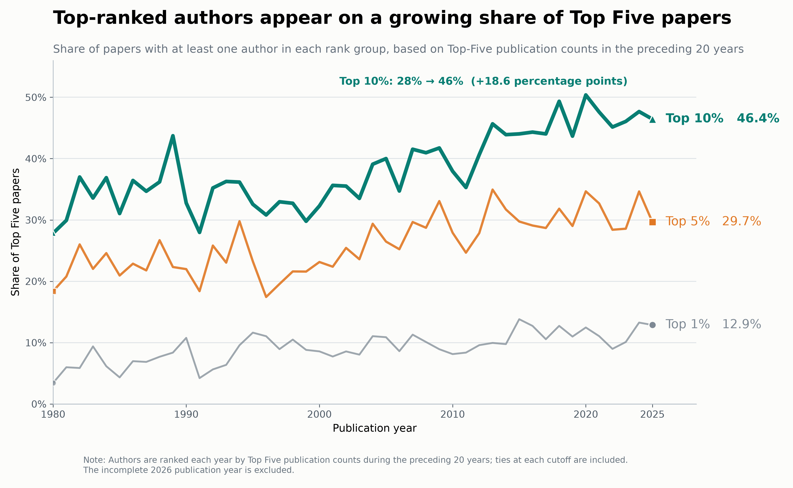

# Has It Become Harder to Break Into Economics' Leading Journals? -- The Changes of the Pathway into Economics’ Top Five Journals

## Overview

How have pathways into economics’ leading journals changed over time? This project examines the evolution of authorship in the journals commonly known as the “Top Five,” with particular attention to researchers publishing in these journals for the first time.[^1] I document three broad shifts. (1) Authorship has become increasingly concentrated around scholars with strong prior Top Five publication records. (2) First-time authors are increasingly likely to publish with coauthors who already have Top Five experience. (3) Among authors who publish in the Top Five more than once, the observed time between successive publications has generally shortened, particularly for more recent cohorts.

A Top Five publication is widely viewed as an important marker of research success in economics. Publication outcomes are likely to reflect genuine differences in research quality, ability, experience, persistence, and access to productive collaborators and feedback. Established scholars may produce stronger work because they have accumulated knowledge, learned how to identify promising questions, and developed more effective research processes.

Prior success may also create advantages that extend beyond research ability alone. Reputation can increase a paper's visibility, facilitate coauthorship with experienced authors, and improve access to institutional resources. Editors and referees may also treat an author's publication record as a signal of quality when evaluating uncertain or highly specialized work. The publication data directly measure coauthorship patterns, not professional networks or editorial perceptions, and cannot distinguish these mechanisms from the effects of experience and skill.

The analysis is descriptive. The data capture published papers, authorship histories, and coauthorship patterns. They do not measure the quality of individual papers, professional networks, institutional support, submissions, rejections, revision times, acceptance probabilities, or editorial decisions. The project therefore cannot determine why the observed patterns changed or whether they reflect barriers to entry. Its purpose is narrower: to document how the concentration of Top Five authorship, the prevalence of repeat publication, and the pathways followed by first-time authors have changed over time.

[^1]: The conventional Top Five journals in economics are the *American Economic Review*, *Econometrica*, *Journal of Political Economy*, *Quarterly Journal of Economics*, and *Review of Economic Studies*.

## Data and Technical Stack

### Technical Stack

- **Data collection:** Python, Requests, Beautiful Soup, OpenAlex API, and Crossref API, Combine multisource paper-level dataset
- **Data processing and record linkage:** pandas, NumPy, DOI normalization, exact matching, and fuzzy name matching
- **Machine learning:** scikit-learn, TF-IDF, logistic regression, PyTorch, Hugging Face Transformers, SPECTER2, and SciBERT
- **Visualization:** Matplotlib and custom interactive HTML/CSS/JavaScript charts
- **Testing and version control:** pytest, Git, and GitHub


### Data Sources

I construct a multisource paper-level dataset covering Top Five publications from 1950 through 2026. Core bibliographic records come from the OpenAlex and Crossref APIs. I enrich these records with metadata from RePEc, AEA journal pages, and NBER, and use targeted web scraping when abstracts, keywords, author information, or JEL codes are unavailable from structured sources.

### Record Linkage and Deduplication

Records are linked across sources primarily by normalized Digital Object Identifiers (DOIs). When a DOI is unavailable or unsuccessful, standardized article titles provide a secondary matching key. The pipeline reconciles DOI variants, consolidates duplicate records, and standardizes journal names, publication dates, titles, author names, and institutional affiliations.

### Author Disambiguation

To construct author-level publication histories, I normalize names across sources and combine exact matching with cautious fuzzy matching. The procedure addresses differences in accents, initials, name order, punctuation, and formatting. Ambiguous matches are flagged for manual review, and each consolidated author is assigned a stable `author_id`.

### Classification of Missing JEL Codes

Approximately 72% of papers in the current Top Five analytic sample lack an observed broad JEL classification. Because a paper may be assigned to several JEL fields, I formulate the task as a multi-label text-classification problem rather than requiring each paper to belong to a single field.

Using article titles, abstracts, and keywords, I estimate three base models:
- TF-IDF features with one-vs-rest logistic regression;
- SPECTER2 document embeddings with one-vs-rest logistic regression; and
- a fine-tuned SciBERT classifier.

I then combine their predicted probabilities in a weighted ensemble. Model performance is evaluated on papers with observed JEL codes using micro and macro F1, precision, recall, Hamming loss, and exact-match subset accuracy. The selected model achieves a micro-averaged precision of 95%, a micro F1 score of 94%, and a macro F1 score of 95%.

Observed and predicted classifications remain separately identified in the data. For the field-level analysis, I use observed JEL codes whenever they are available and model-generated classifications only when the observed codes are missing.

### Current Analytic Sample

The cleaned Top Five sample currently contains:

- **23,486 distinct papers**;
- **15,608 disambiguated authors**; and
- **42,468 paper-author observations**.

The sample covers 1950-2026. Because 2026 is incomplete, observations from that year are provisional. Coverage of abstracts, JEL codes, and institutional affiliations varies across journals and over time.

### Key Definitions

- **Publication counting:** The author rankings use full counting, so a coauthored paper contributes one publication to each author. Paper-level shares count each paper only once.
- **Top-ranked author:** An author in the top 1%, 5%, or 10% of the publication-count distribution calculated from the preceding 20 years.
- **New author:** An author whose first observed Top Five publication occurs in the indicated year.
- **Experienced coauthor:** A coauthor with at least one observed Top Five publication before the focal author's first Top Five publication.
- **Field:** A broad JEL category based on the observed code when available and the SciBERT-predicted code otherwise.

## Research Question

How have entry, persistence, and the concentration of authorship in economics' Top Five journals changed over time, and has publication without a prior Top Five record become less common?

## Preliminary Main Findings

### Finding 1: Top-ranked authors appear on a growing share of papers

Figure 1 asks how frequently a Top Five paper includes at least one author with a strong recent publication record. Author rankings are recalculated each year using publication counts during the preceding 20 years. The share of papers with at least one top-10% author increased from 27.8% in 1980 to 46.4% in 2025. The corresponding share rose from 18.4% to 29.7% for the top 5% and from 3.4% to 12.9% for the top 1%.

By 2025, nearly half of Top Five papers therefore included an author ranked in the preceding 20-year top 10%. Because the increase appears at all three thresholds, the change is not confined to a small group at the very top of the publication distribution. Authors with strong recent Top Five records have become more prevalent across published papers.

It is not surprising that experienced and highly productive authors publish more frequently. They may have accumulated knowledge, developed more effective research processes, established productive collaborations, or managed several projects simultaneously. What is more striking is how substantially their presence on Top Five papers has increased over time.

Several mechanisms could produce this pattern. Larger research teams mechanically increase the likelihood that a paper includes at least one highly ranked author. Greater specialization may encourage collaboration among researchers with complementary skills, while experienced scholars may increasingly coauthor with newer researchers. Prior publication success may also bring accumulated experience, access to productive collaborators, greater visibility, and reputational advantages that support continued Top Five publication. These interpretations should be treated cautiously: the analysis is purely descriptive, and publication records alone cannot distinguish among these possible explanations.

<figure>
  
  <figcaption>Figure 1. Share of Top Five papers with at least one author ranked in the top 1%, 5%, or 10% of publication counts during the preceding 20 years. Rankings are recalculated annually.</figcaption>
</figure>

### Finding 2: First-time authors account for a smaller share of authors

Figure 2 examines the composition of authors publishing in the Top Five each year. An author is classified as new in the year of their first observed Top Five publication; all other authors are classified as returning authors. Each author is counted only once within a year, regardless of how many papers they publish.

In 1980, first-time authors represented 44.9% of all authors publishing in the Top Five. By 2025, their share had fallen to 35.9%, a decline of approximately 9 percentage points. Although the series fluctuates from year to year, its broader direction is downward. Returning authors therefore account for a substantially larger share of the Top Five author pool than they did in the past. 

This decline does not mean that fewer first-time authors are publishing in absolute terms. Given that the number of coauthors increases by a large extent in recent years, it is not surprising that the number of first-time authors increased from 209 in 1980 to 392 in 2025. The total number of participating authors, however, grew even faster. The result is therefore best understood as a change in composition: the Top Five expanded and included more first-time authors, but the number of returning authors expanded more rapidly.

The decline in the new-author share complements Figure 1: both indicate that authors with previous Top Five experience have become more prevalent in the published author pool.

These findings do not establish that opportunities for first-time authors have declined. A “new author” is new only to the Top Five and may already have substantial experience publishing elsewhere. Moreover, the data contain published papers rather than submissions and rejections. The conclusion is that growth in repeat participation has outpaced growth in first-time participation.

<figure>
  
  <figcaption>Figure 2. Share of distinct authors in each year whose first observed Top Five publication occurs in that year. Authors are counted once within each year, and the observation window begins in 1950.</figcaption>
</figure>

### Finding 3: First-time authors increasingly publish with experienced coauthors

Figure 3 examines how new authors first appear in the Top Five. It separates them into three mutually exclusive groups: those publishing with at least one coauthor who has previously published in the Top Five, those publishing only with other first-time authors, and those publishing alone.

In 1980, 27.3% of new authors published with an experienced coauthor during their first observed year in the Top Five. By 2025, that share had reached 76.8%, an increase of almost 50 percentage points. The proportion therefore rose from slightly more than one in four new authors to more than three in four.

The other two pathways became less common. The share entering through solo-authored work fell from 48.8% to 6.9%, while the share publishing only with other newcomers declined from 23.9% to 16.3%. The most common route into the Top Five has therefore shifted from publishing alone to publishing as part of a team that already contains Top Five experience.

It is plausible that experienced coauthors strengthen a research project. They may contribute accumulated knowledge, complementary expertise, feedback, access to resources, or familiarity with developing research for leading journals. What is striking, however, is the magnitude of the increase in first-time authors publishing with experienced coauthors.

Several mechanisms may help explain the change. The sharp decline in solo entry is consistent with the broader growth of coauthorship, larger research teams, and greater specialization within economics. However, the decline in teams composed exclusively of first-time authors is also notable: the growth of collaboration has not translated into more entry through newcomer-only teams. Instead, entry has increasingly occurred through teams containing at least one author with prior Top Five experience.[^2]

A first-time Top Five author is also not necessarily a junior researcher and may have substantial publication experience elsewhere. Because the data contain only published papers, the analysis cannot establish that experienced coauthors cause publication success or that entering without one has become more difficult. The narrower conclusion is that first appearances in the Top Five have become much more closely associated with coauthorship involving prior Top Five experience.

<figure>
  
  <figcaption>Figure 3. Coauthor composition during each new author’s first observed year in the Top Five. The mutually exclusive categories are publication with at least one experienced coauthor, publication only with other new authors, and solo-authored publication.</figcaption>
</figure>

[^2]: This comparison remains sensitive to team size. As the number of coauthors increases, the probability that at least one team member has prior Top Five experience also rises mechanically. Distinguishing this mechanical effect from a deeper change in the role of experience would require comparing teams of similar sizes or estimating how much of the trend can be explained by changes in coauthorship alone.

### Finding 4: Observed gaps between Top Five publications have shortened

Figure 4 groups authors by the decade of their first Top Five publication and compares the average number of years between consecutive publications. It shows both how publication gaps change as authors accumulate more Top Five papers and how those gaps differ across entry cohorts.

Two patterns stand out. First, within most cohorts, the observed gap tends to become shorter at later publication stages. The interval from the first to the second publication is generally longer than the intervals between later publications. This may reflect learning, established research collaborations, several projects moving through the publication process simultaneously, or the visibility and resources associated with an existing publication record. This pattern also reflects selection. Authors who reach their fifth, sixth, or later Top Five publication are an unusually persistent and productive group. The shorter gaps at later stages therefore do not describe the career trajectory of a typical author. Instead, each successive transition represents a more selected group of repeat publishers.

Second, the same publication transition is generally shorter for newer cohorts. Among authors with an observed second publication, the average gap from the first to the second Top Five paper was 5.9 years for the 1981–1990 entry cohort, 5.6 years for the 1991–2000 cohort, 4.6 years for the 2001–2010 cohort, and 3.5 years for the 2011–2020 cohort. Similar differences appear at several later publication stages. 

These cohort differences could reflect changes in research production, team size, coauthorship, specialization, or the publication process. They are also consistent with prior Top Five success providing greater momentum through accumulated experience, productive collaborations, visibility, or reputational advantages. The figure cannot distinguish among these explanations.

<figure>
  
  <figcaption>Figure 4. Average observed years between consecutive Top Five publications, grouped by the decade of an author’s first Top Five publication. Each transition includes only authors who reach the subsequent publication within the observation period.</figcaption>
</figure>

Figure 5 examines the cohort pattern more closely by focusing only on the transition from an author’s first to second Top Five publication. Instead of combining authors into ten-year groups, it reports the average observed gap separately for each year of entry.

Among authors with an observed second publication, the average gap declined from 5.5 years for those entering in 1980 to 2.5 years for those entering in 2020. Although the annual series fluctuates, its broader direction is downward. Recent entrants who publish a second Top Five paper are therefore observed returning more quickly than comparable repeat publishers from earlier entry years.

This pattern may indicate that a first Top Five publication is increasingly followed by additional publication momentum. That momentum could arise through learning, visibility, access to collaborators and feedback, multiple projects already in progress, or reputational advantages. 

Incomplete follow-up is particularly important for interpreting both figures. Recent entrants have had less time to publish again, so authors who return quickly are disproportionately represented. Authors with longer gaps may not yet have an observed second publication, while authors who never publish again are excluded entirely. These features can make the average gaps for recent cohorts appear artificially short.

The narrow conclusion is that, among authors whose subsequent Top Five publications are observed within the sample period, repeat publications occur sooner for more recent entrants. The figures do not establish that the expected time to a subsequent publication has declined for all authors entering the Top Five.

<figure>
  
  <figcaption> Figure 5. Average observed years between authors’ first and second Top Five publications, shown separately by year of first publication. Only authors with an observed second publication are included.</figcaption>
</figure>

## Differences Across Fields

The aggregate findings may conceal important differences across areas of economics. I therefore repeat four comparisons for the ten broad JEL fields with the largest numbers of Top Five papers: C, D, E, F, G, H, I, J, L, and O, which are the top 10 fields with largest publications in top five journals. Field assignments use observed JEL codes when available and model-generated classifications otherwise. Because a paper may have several broad JEL codes, it contributes to every applicable field. Field counts consequently overlap and should not be added together.

The definitions in this section are field-specific. A top-ranked author is ranked using publications in the relevant field during the preceding 20 years. A new author is someone publishing in that field for the first time observed in the data, even if the author has previously published a Top Five paper in another field. Similarly, an experienced coauthor has an earlier Top Five publication in the same field. These measures describe entry and persistence within fields rather than entry into the Top Five as a whole.
The broad patterns found in the aggregate analysis recur across most fields, although their magnitudes vary.

### Field Finding 1: Concentration increased in every major field

The share of papers with at least one field-specific top-10% author increased in all ten fields between 1995–2000 and 2020–2025. In the recent period, this share reached approximately 40% or 41% in microeconomics, macroeconomics, quantitative methods, international economics, and labor economics. Industrial organization had the lowest recent share at 23.5%, followed by financial economics at 30.5%.

The size of the increase differs substantially across fields. International economics and public economics each rose by approximately 20 percentage points, while labor economics and development and growth increased by about 19 points. Quantitative methods began with the highest concentration and changed comparatively little, increasing from 38.4% to 40.3%.
The increase across all ten fields indicates that the aggregate trend is not driven by a single area of economics. Nevertheless, differences in field size, coauthorship practices, specialization, and research-team structure may help explain why concentration increased more in some fields than in others. Because rankings are calculated separately within each field, the figure compares changes in concentration rather than absolute productivity across fields.

<figure>
  
  <figcaption> Figure 6. Share of papers with at least one field-specific top-10% author in 1995-2000 and 2020-2025. Rankings are recalculated annually using publication counts in that field during the preceding 20 years.</figcaption>
</figure>

### Field Finding 2: New-author shares declined in most fields

The share of authors who were new to a field declined in nine of the ten fields. The largest decrease occurred in health, education, and welfare, where the share fell from 92.8% to 72.8%. Development and growth declined from 86.2% to 69.4%, while public economics declined from 84.1% to 74.1%. Macroeconomics changed comparatively little, falling by approximately 1.2 percentage points.

Quantitative methods was the only exception. Its new-author share increased from 60.4% to 64.8%. This exception shows that a declining new-author share is not mechanically produced by the way the measure is constructed.[^2]

[^2]: The field-specific percentages are higher than the overall new-author share because they measure entry into individual fields. An author who has previously published in macroeconomics, for example, is still considered new to public economics when first publishing there. The appropriate interpretation is therefore that repeat participation within fields became more prevalent in nine of the ten areas, not that the same proportion of authors were entering the Top Five for the first time.

<figure>
  
  <figcaption> Figure 7. Share of distinct authors in each field-period who are observed publishing in that field for the first time. Authors are counted once within each field and period.</figcaption>
</figure>

### Field Finding 3: Entry increasingly involves field-experienced coauthors

In all ten fields, a larger share of new authors published with someone who had previously published in the same field. The increase ranged from 6.8 percentage points in quantitative methods to 40.1 points in health, education, and welfare. Large increases also occurred in public economics (35.9 points), development and growth (33.1 points), and labor economics (32.9 points).

Solo entry became less common in every field. In 1995–2000, the solo-authored share ranged from approximately 18% to 26%; by 2020–2025, it ranged from approximately 6% to 9%. Entry only with other field newcomers also declined in nine fields. Quantitative methods again differed from the general pattern: its newcomer-only share increased from 32.0% to 38.1%, alongside a comparatively small increase in entry with experienced coauthors. The broad shift toward entering with field-experienced coauthors is therefore not limited to one part of economics. 

<figure>
  
  <figcaption> Figure 8. Coauthor composition during new authors’ first observed publication year in each field. The mutually exclusive categories are entry with an experienced coauthor, entry only with other field newcomers, and solo-authored entry. Arrows show percentage-point changes from 1995–2000 to 2020–2025.</figcaption>
</figure>

### Field Finding 4: Observed gaps to a second publication shortened in every field

Among authors with an observed second publication in the same field, the average gap from the first to the second publication was shorter for the 2010–2015 entry cohort than for the 1995–2000 cohort in all ten fields. For the earlier cohort, the average gaps ranged from 5.2 years in international economics to 8.0 years in industrial organization. For the later cohort, they ranged from 3.6 years in health, education, and welfare to 4.9 years in financial economics.

The largest decline occurred in industrial organization, where the observed average fell from 8.0 to 4.4 years. Quantitative methods declined from 7.3 to 4.5 years, while health, education, and welfare declined from 6.3 to 3.6 years. International economics changed the least, moving from 5.2 to 4.7 years.

The consistency across fields is notable, but the limitations affecting the overall comparison remain. The calculation includes only authors with an observed second publication in the same field, and more recent entrants have a shorter period in which that publication can be observed.

To reduce this incomplete-follow-up problem, I use 2010–2015 as the latest entry cohort rather than a more recent period. Because the data extend through 2026, even authors entering in 2015 have at least 11 years of follow-up. This substantially increases the opportunity to observe a second publication, but it does not eliminate the concern. Authors with unusually long publication gaps may still be missing, while authors who never publish a second paper are excluded by construction. The reported gaps should therefore be interpreted as outcomes among observed repeat publishers rather than as the expected time to a second publication for all entrants.

<figure>
  
  <figcaption> Figure 9. Average observed years from an author’s first to second Top Five publication in the same field, comparing the 1995–2000 and 2010–2015 field-entry cohorts. Only authors with an observed second publication in that field are included.</figcaption>
</figure>

Taken together, the field comparisons show that the aggregate changes are broadly distributed across economics rather than being driven by one specialty. Concentration increased in every field, new-author shares declined in most fields, entry increasingly involved field-experienced coauthors, and observed publication gaps shortened across all ten areas. The quantitative-methods field provides the clearest exception to parts of this general pattern, underscoring that the magnitude and form of these changes differ across areas.

## Interpretation and Limitations

Given the limitation of the data: they capture published papers rather than submissions, rejections, time spent in revision and resubmission, or acceptance probabilities, we should interpret the results with cautious. The patterns may also reflect changes in coauthorship, team size, and research production. However, these findings consistently show that prior Top Five experience has become more closely associated with authorship and entry. These evidence indicates that it becomes harder for researchers without an established publication record to break into economics' leading journals. More detailed data on the submission and editorial process would be needed to assess directly whether, why, and how barriers to entry have changed for researchers without a prior Top Five publication.

## Project Structure

```text
data/                         # Raw and processed data (not tracked by Git)
outputs/
  figures/                    # Static PNGs, interactive HTML, and figure data
  tables/                     # Summary tables
src/
  Step0_PreProcessingData/    # Data collection and parsing
  Step1_CleanOpenalexCrossrefData/
  Step2_MergeAllDatasets/
  Step3_TrainingModelClassifyJELCodes/
  Step4_CleanAuthorNames/
  Step5_EnrichAuthorEducation/
