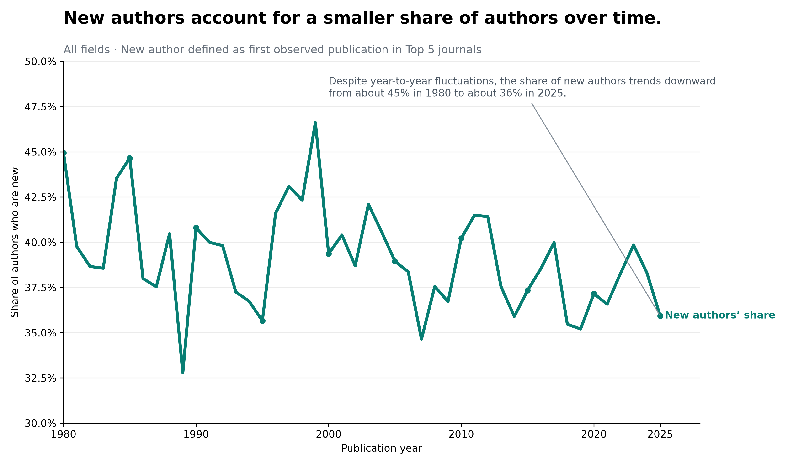
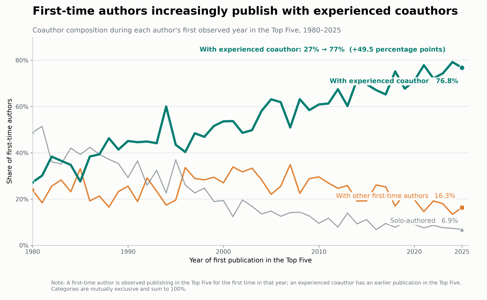
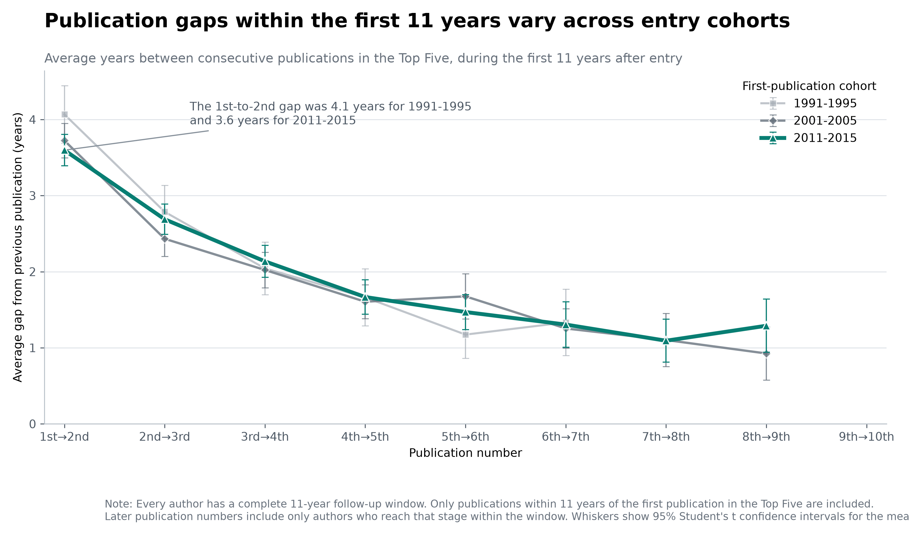
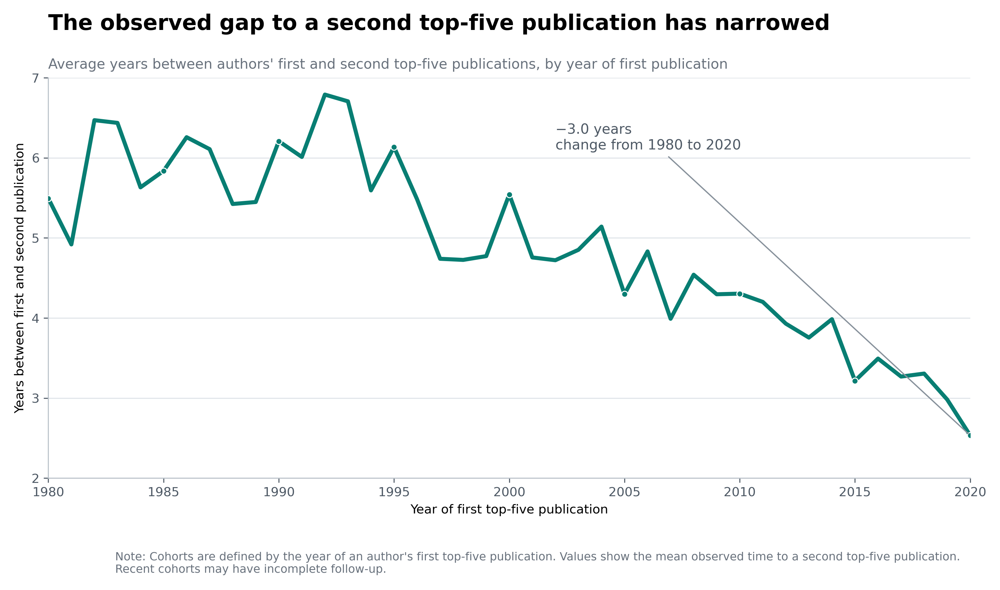
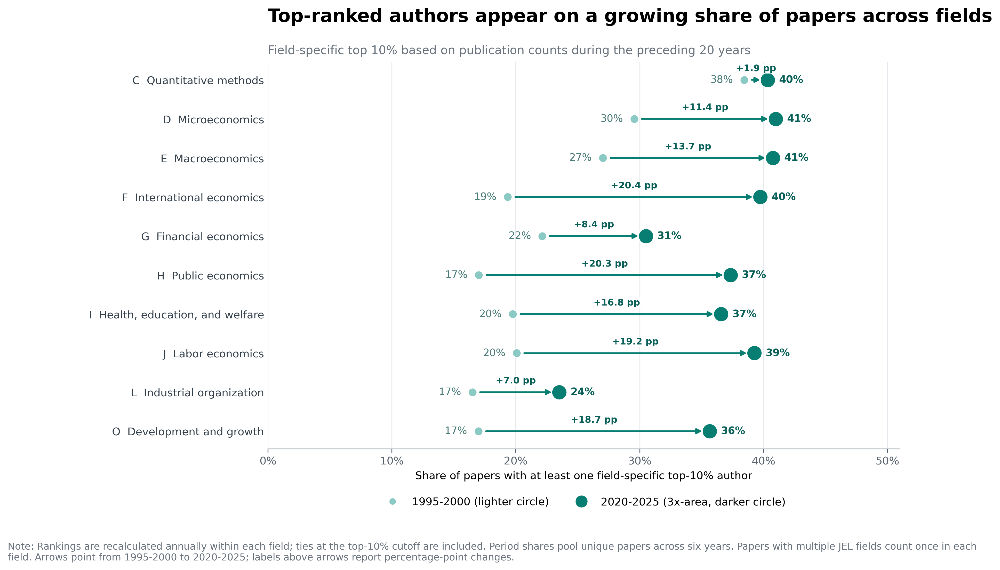
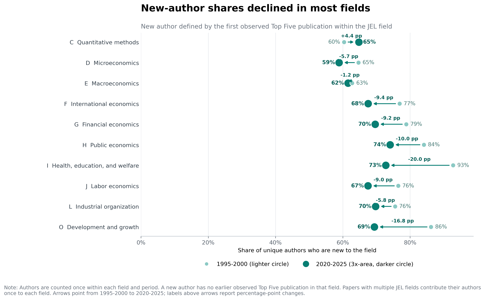
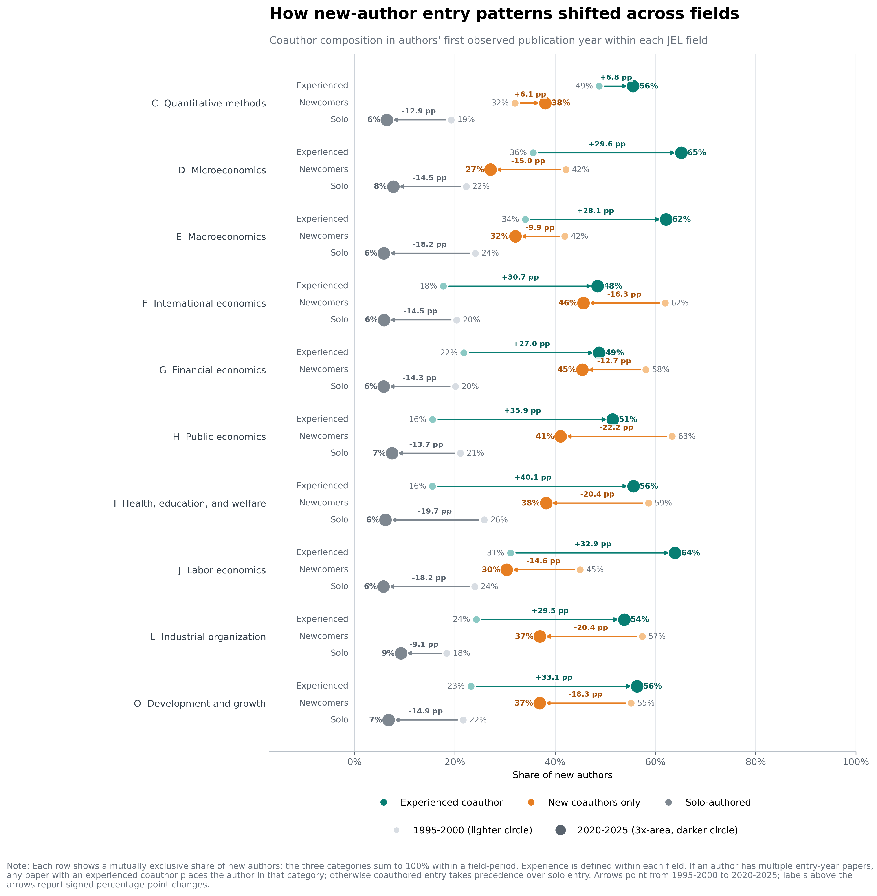
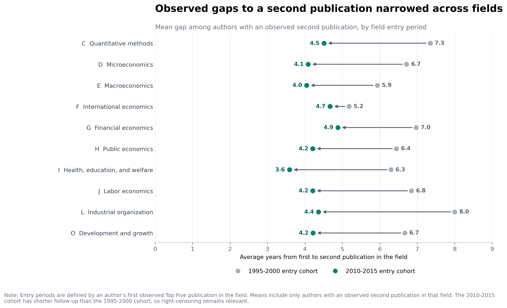

# Who Publishes in Economics’ Top Five? Experience, Entry, and Coauthorship over Time

## Overview

How have pathways into economics’ leading journals changed over time? This project examines the evolution of authorship in the journals commonly known as the “Top Five,” with particular attention to researchers publishing in these journals for the first time.[^1] I document three broad shifts. (1) Authorship has become increasingly concentrated around scholars with strong prior Top Five publication records. (2) First-time authors are increasingly likely to publish with coauthors who already have Top Five experience. (3) Among authors who publish in the Top Five more than once, the observed time between successive publications has generally shortened, particularly for more recent cohorts.

A Top Five publication is widely viewed as an important marker of research success in economics. Publication outcomes are likely to reflect genuine differences in research quality, ability, experience, persistence, and access to productive collaborators and feedback. Established scholars may produce stronger work because they have accumulated knowledge, learned how to identify promising questions, and developed more effective research processes.

Prior success may also create advantages that extend beyond research ability alone. Reputation can increase a paper's visibility, facilitate coauthorship with experienced authors, and improve access to institutional resources. Editors and referees may also treat an author's publication record as a signal of quality when evaluating uncertain or highly specialized work. The publication data directly measure coauthorship patterns, not professional networks or editorial perceptions, and cannot distinguish these mechanisms from the effects of experience and skill.

The analysis is descriptive. The data capture published papers, authorship histories, and coauthorship patterns. They do not measure the quality of individual papers, professional networks, institutional support, submissions, rejections, revision times, acceptance probabilities, or editorial decisions. The project therefore cannot determine why the observed patterns changed or whether they reflect barriers to entry. Its purpose is narrower: to document how the concentration of Top Five authorship, the prevalence of repeat publication, and the pathways followed by first-time authors have changed over time.

[^1]: The conventional Top Five journals in economics are the *American Economic Review*, *Econometrica*, *Journal of Political Economy*, *Quarterly Journal of Economics*, and *Review of Economic Studies*.

## Data and Technical Stack

### Technical Stack

- **Data collection:** Python, Requests, Beautiful Soup, OpenAlex API, and Crossref API, Combine multisource paper-level dataset
- **Data processing and record linkage:** pandas, NumPy, DOI normalization, exact matching, and fuzzy name matching
- **Machine learning:** scikit-learn, TF-IDF, logistic regression, PyTorch, Hugging Face Transformers, SPECTER2, and SciBERT
- **Visualization:** Matplotlib and custom interactive HTML/CSS/JavaScript charts
- **Testing and version control:** pytest, Git, and GitHub


### Data Sources

I construct a multisource paper-level dataset covering Top Five publications from 1950 through 2026. Core bibliographic records come from the OpenAlex and Crossref APIs. I enrich these records with metadata from RePEc, AEA journal pages, and NBER, and use targeted web scraping when abstracts, keywords, author information, or JEL codes are unavailable from structured sources.

### Record Linkage and Deduplication

Records are linked across sources primarily by normalized Digital Object Identifiers (DOIs). When a DOI is unavailable or unsuccessful, standardized article titles provide a secondary matching key. The pipeline reconciles DOI variants, consolidates duplicate records, and standardizes journal names, publication dates, titles, author names, and institutional affiliations.

### Author Disambiguation

To construct author-level publication histories, I normalize names across sources and combine exact matching with cautious fuzzy matching. The procedure addresses differences in accents, initials, name order, punctuation, and formatting. Ambiguous matches are flagged for manual review, and each consolidated author is assigned a stable `author_id`.

### Classification of Missing JEL Codes

Approximately 72% of papers in the current Top Five analytic sample lack an observed broad JEL classification. Because a paper may be assigned to several JEL fields, I formulate the task as a multi-label text-classification problem rather than requiring each paper to belong to a single field.

Using article titles, abstracts, and keywords, I estimate three base models:
- TF-IDF features with one-vs-rest logistic regression;
- SPECTER2 document embeddings with one-vs-rest logistic regression; and
- a fine-tuned SciBERT classifier.

I then combine their predicted probabilities in a weighted ensemble. Model performance is evaluated on papers with observed JEL codes using micro and macro F1, precision, recall, Hamming loss, and exact-match subset accuracy. The selected model achieves a micro-averaged precision of 95%, a micro F1 score of 94%, and a macro F1 score of 95%.

Observed and predicted classifications remain separately identified in the data. For the field-level analysis, I use observed JEL codes whenever they are available and model-generated classifications only when the observed codes are missing.

### Current Analytic Sample

The cleaned Top Five sample currently contains:

- **23,486 distinct papers**;
- **15,608 disambiguated authors**; and
- **42,468 paper-author observations**.

The sample covers 1950-2026. Because 2026 is incomplete, observations from that year are provisional. Coverage of abstracts, JEL codes, and institutional affiliations varies across journals and over time.

### Key Definitions

- **Publication counting:** The author rankings use full counting, so a coauthored paper contributes one publication to each author. Paper-level shares count each paper only once.
- **Top-ranked author:** An author in the top 1%, 5%, or 10% of the publication-count distribution calculated from the preceding 20 years.
- **New author:** An author whose first observed Top Five publication occurs in the indicated year.
- **Experienced coauthor:** A coauthor with at least one observed Top Five publication before the focal author's first Top Five publication.
- **Field:** A broad JEL category based on the observed code when available and the SciBERT-predicted code otherwise.

## Research Question

How have entry, persistence, and the concentration of authorship in economics' Top Five journals changed over time, and has publication without a prior Top Five record become less common?

## Preliminary Main Findings

### Finding 1: Top-ranked authors appear on a growing share of papers

Figure 1 asks how frequently a Top Five paper includes at least one author with a strong recent publication record. Author rankings are recalculated each year using publication counts during the preceding 20 years. The share of papers with at least one top-10% author increased from 27.8% in 1980 to 46.4% in 2025. The corresponding share rose from 18.4% to 29.7% for the top 5% and from 3.4% to 12.9% for the top 1%.

By 2025, nearly half of Top Five papers therefore included an author ranked in the preceding 20-year top 10%. Because the increase appears at all three thresholds, the change is not confined to a small group at the very top of the publication distribution. Authors with strong recent Top Five records have become more prevalent across published papers.

It is not surprising that experienced and highly productive authors publish more frequently. They may have accumulated knowledge, developed more effective research processes, established productive collaborations, or managed several projects simultaneously. What is more striking is how substantially their presence on Top Five papers has increased over time.

Several mechanisms could produce this pattern. Larger research teams mechanically increase the likelihood that a paper includes at least one highly ranked author. Greater specialization may encourage collaboration among researchers with complementary skills, while experienced scholars may increasingly coauthor with newer researchers. Prior publication success may also bring accumulated experience, access to productive collaborators, greater visibility, and reputational advantages that support continued Top Five publication. These interpretations should be treated cautiously: the analysis is purely descriptive, and publication records alone cannot distinguish among these possible explanations.

[![Share of papers with a top-ranked author\]\(outputs/figures/overall/Graph1_TopAuthorPaperShares_After1980.png)](outputs/figures/overall/Graph1_TopAuthorPaperShares_After1980.html)
*Figure 1. Share of Top Five papers with at least one author ranked in the top 1%, 5%, or 10% of publication counts during the preceding 20 years. Rankings are recalculated annually.*

### Finding 2: New authors account for a smaller share of authors

This figure looks at all authors appearing in the Top Five in a given year and asks what share are publishing there for the first time. In 1980, new authors accounted for **44.9%** of authors. By 2025, their share had fallen to **35.9%**, a decline of about 9 percentage points. The series moves up and down from year to year, but the broader pattern is that repeat authors make up a larger part of the Top Five author pool than they did in the past.

The declining share does not mean that fewer new authors are publishing in absolute terms. The number of new authors increased from **209 in 1980 to 392 in 2025**, while the total number of authors grew even faster. The figure is therefore best understood as a change in composition: the Top Five expanded, but a smaller proportion of participating authors were first-time entrants.

Several developments could contribute to this pattern, including larger author teams, longer publishing careers, and more repeat publication by experienced scholars.

[](outputs/figures/overall/Graph2_1_NewAuthorShare_1980_2025.html)

*Figure 2. Percentage of authors in each year who are publishing in the Top Five for the first time observed in this dataset. The observation window begins in 1950.*

### Finding 3: New authors increasingly publish with experienced coauthors

This figure separates new authors into three groups according to how they first appear in the Top Five: with at least one coauthor who has published there before, only with other newcomers, or alone. In 1980, **27.3%** of new authors published with an experienced coauthor. By 2025, that share had reached **76.8%**, rising from a little more than one in four new authors to more than three in four.

The other two paths became less common. The share entering through solo-authored work fell from **48.8% to 6.9%**, while the share publishing only with other new authors declined from **23.9% to 16.3%**. The typical path into the Top Five has therefore shifted away from entering alone and toward entering as part of a team that already includes Top Five experience.

Experienced coauthors may contribute knowledge, feedback, complementary skills, or familiarity with producing research for leading journals. Coauthorship with established ones undoubtedly provides a large advantage, especially for junior researchers. This advantage becomes more and more dominant in recent years, while researches from less established authors without connection to established coauthors become harder and harder to break into the elite publication.


[](outputs/figures/overall/Graph3_NewAuthorCoauthorType_1980_2025.html)

*Figure 3. Coauthor composition during each new author's first observed year in the Top Five. The categories are mutually exclusive: at least one experienced coauthor, only new coauthors, or solo-authored.*

### Finding 4: Observed publication gaps are shorter for newer cohorts

This figure groups authors by the decade in which they first published in the Top Five and compares the time between each pair of consecutive publications. Two patterns stand out.

First, within each cohort, the observed waiting time generally becomes shorter as authors accumulate more Top Five publications. The gap from the first to the second publication is usually longer than the gaps between later publications, although the decline is not perfectly smooth at every step. This pattern could reflect learning by doing, more established research teams, several projects moving forward at the same time, or a publication record that gives an author greater visibility and credibility. It also reflects selection: authors who reach their fifth, sixth, or later Top Five publication are likely to be unusually persistent and productive.

Second, and more importantly for this project, the same publication step is generally reached faster by newer cohorts. For example, the average gap from the first to the second publication was **5.9 years for the 1981-1990 entry cohort**, **5.6 years for the 1991-2000 cohort**, **4.6 years for the 2001-2010 cohort**, and **3.5 years for the 2011-2020 cohort**. Similar differences appear at later publication stages.

This across-cohort pattern is consistent with the possibility that an existing Top Five record provides more momentum, including a stronger reputation advantage, than it did in the past. The graph cannot isolate that channel, however. Changes in coauthorship, team size, research production, the publication process, and the types of authors who continue publishing could also shorten the observed gaps. Recent cohorts have also had less time to produce their next paper, so incomplete follow-up may make their gaps appear shorter.

Note that Incomplete follow-up is especially important for later years. Authors in 2011-2020 can be observed for only a few years, so those who take longer to publish a later papers may not yet appear in the calculation. The figure also excludes entrants who never publish a second Top Five paper.

[](outputs/figures/overall/Graph4_ConsecutivePublicationGaps_ByCohort.html)

*Figure 4. Average observed years between consecutive Top Five publications, grouped by the decade of an author's first Top Five publication. Each transition includes only authors who reach the next publication.*

Figure 5 follows up on the first pattern in Figure 4 by focusing only on the move from an author's first Top Five publication to the second. Instead of grouping authors into ten-year cohorts, it shows the average observed gap separately for each year of entry.

The average gap fell from **5.5 years for authors entering in 1980** to **2.5 years for authors entering in 2020**, a decline of approximately **3.0 years**. Although the annual series fluctuates, its broader direction is downward. Among authors for whom a second Top Five publication is observed, recent entrants returned to the Top Five more quickly than entrants in earlier years.

This pattern is consistent with the idea that a first Top Five publication creates momentum for subsequent work. That momentum could come from learning, greater visibility, stronger coauthor opportunities, improved access to feedback and resources, or a reputation advantage. If so, the first publication may have become a more important dividing line between researchers who are outside the Top Five and those who have already entered it. The graph does not determine which of these mechanisms is responsible.

Incomplete follow-up is especially important here. Authors entering in 2020 can be observed for only a few years, so those who take longer to publish a second paper may not yet appear in the calculation. The figure also excludes entrants who never publish a second Top Five paper.

[](outputs/figures/overall/Graph5_FirstToSecondPublicationGap_1980_2020.html)

*Figure 5. Average observed years between authors' first and second Top Five publications, shown separately by year of first publication. Only authors with an observed second publication are included.*

## Differences Across Fields

The overall patterns could conceal important differences across areas of economics. This section repeats four comparisons for top ten broad JEL fields: C, D, E, F, G, H, I, J, L, and O (based on the number of publised papers in each classification). A paper with several broad JEL codes enters every applicable field, so field counts overlap and should not be added together. The overall results show that all fields have very similar patterns as the overall pattern.

The field analysis also uses a narrower definition of entry than the overall analysis. A "new author" is an author publishing in the indicated field for the first time observed in this dataset, even if that author previously published a Top Five paper in another field. Similarly, an "experienced coauthor" has an earlier observed Top Five publication in the same field. These definitions show movement into and persistence within fields rather than entry into the Top Five as a whole.

### Field Finding 1: Concentration increased in every major field

The share of papers with at least one field-specific top-10% author increased in all ten fields between 1995-2000 and 2020-2025. The recent share is approximately **40% or 41%** in microeconomics, macroeconomics, quantitative methods, international economics, and labor economics. Industrial organization has the lowest recent share at **23.5%**, followed by financial economics at **30.5%**.

The size of the increase varies substantially. International economics and public economics each rose by about **20 percentage points**, while labor economics and development and growth rose by approximately **19 points**. Quantitative methods started with the highest earlier-period concentration and changed comparatively little, increasing from **38.4% to 40.3%**. The fact that concentration rises in every field suggests that the aggregate trend is not driven by one area of economics.

[](outputs/figures/by_field/Graph1_FieldTop10AuthorShares_1995_2000_vs_2020_2025.png)

*Figure 6. Share of papers with at least one field-specific top-10% author in 1995-2000 and 2020-2025. Rankings are recalculated annually using publication counts in that field during the preceding 20 years. Ties at the cutoff are included.*

### Field Finding 2: New-author shares declined in most fields

The share of active authors who were new to a field fell in nine of the ten fields. The largest decline appears in health, education, and welfare, where the share fell from **92.8% to 72.8%**. Development and growth declined from **86.2% to 69.4%**, while public economics declined from **84.1% to 74.1%**. Macroeconomics changed little, falling by approximately **1.2 percentage points**.

Quantitative methods is the only exception: its new-author share increased from **60.4% to 64.8%**. This exception is useful because it shows that the overall decline is not mechanically imposed by the method. Field entry remains common in every area, but repeat participants make up a larger share of authors in most fields than they did in the earlier period.

These percentages are higher than the overall new-author share because they measure entry into a field. An author who previously published in macroeconomics, for example, is still new to public economics when first appearing there.

[](outputs/figures/by_field/Graph2_FieldNewAuthorShares_1995_2000_vs_2020_2025.png)

*Figure 7. Share of distinct authors in each field-period who are observed publishing in that field for the first time. Authors are counted once within each field and period.*

### Field Finding 3: Entry increasingly involves field-experienced coauthors

In all ten fields, a larger share of new authors entered with someone who had previously published in that field. The increase ranges from **6.8 percentage points** in quantitative methods to **40.1 points** in health, education, and welfare. Large increases also appear in public economics (**35.9 points**), development and growth (**33.1 points**), and labor economics (**32.9 points**).

Solo entry became less common in every field. In 1995-2000, the solo-authored share ranged from approximately **18% to 26%**; by 2020-2025, it ranged from approximately **6% to 9%**. Entry only with other newcomers also declined in nine fields. Quantitative methods again differs: its newcomer-only share increased from **32.0% to 38.1%**, alongside a smaller increase in entry with experienced coauthors. The broad shift is toward entering a field through collaboration with someone who already has field-specific Top Five experience.

[](outputs/figures/by_field/Graph3_FieldNewAuthorCoauthorComposition_1995_2000_vs_2020_2025.png)

*Figure 8. Coauthor composition during new authors' first observed publication year in each field. The three mutually exclusive categories are entry with an experienced coauthor, entry only with other field newcomers, and solo-authored entry. Arrows show percentage-point changes from 1995-2000 to 2020-2025.*

### Field Finding 4: Observed return times shortened in every field

Among authors with an observed second publication in the same field, the average gap from the first to the second publication is shorter for the 2010-2015 entry cohort than for the 1995-2000 cohort in every field. For the earlier cohort, average gaps range from **5.2 years** in international economics to **8.0 years** in industrial organization. For the later cohort, they range from **3.6 years** in health, education, and welfare to **4.9 years** in financial economics.

The largest decline appears in industrial organization, where the observed average falls from **8.0 to 4.4 years**. Quantitative methods declines from **7.3 to 4.5 years**, and health, education, and welfare declines from **6.3 to 3.6 years**. International economics changes least, moving from **5.2 to 4.7 years**.

[](outputs/figures/by_field/Graph4_FieldFirstToSecondPublicationGap_1995_2000_vs_2010_2015.png)

*Figure 9. Average observed years from an author's first to second Top Five publication in the same field, comparing the 1995-2000 and 2010-2015 field-entry cohorts. Only authors with an observed second publication in that field are included.*

## Interpretation and Limitations

Given the limitation of the data: they capture published papers rather than submissions, rejections, time spent in revision and resubmission, or acceptance probabilities, we should interpret the results with cautious. The patterns may also reflect changes in coauthorship, team size, and research production. However, these findings consistently show that prior Top Five experience has become more closely associated with authorship and entry. These evidence indicates that it becomes harder for researchers without an established publication record to break into economics' leading journals. More detailed data on the submission and editorial process would be needed to assess directly whether, why, and how barriers to entry have changed for researchers without a prior Top Five publication.

## Project Structure

```text
data/                         # Raw and processed data (not tracked by Git)
outputs/
  figures/                    # Static PNGs, interactive HTML, and figure data
  tables/                     # Summary tables
src/
  Step0_PreProcessingData/    # Data collection and parsing
  Step1_CleanOpenalexCrossrefData/
  Step2_MergeAllDatasets/
  Step3_TrainingModelClassifyJELCodes/
  Step4_CleanAuthorNames/
  Step5_EnrichAuthorEducation/
